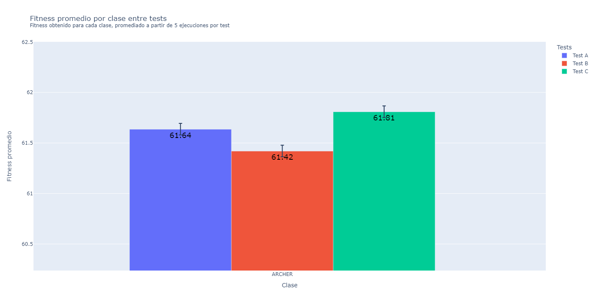

# TP2 SIA - Métodos Genéticos


## Introducción

Trabajo práctico orientativo para la materia Sistemas de Inteligencia Artificial con el
objetivo de implementar un algoritmo genético para optimizar la configuración de personajes de un juego de rol.

[Enunciado](src/docs/SIA_TP2.pdf)

### Requisitos

- Python3
- pip3
- [pipenv](https://pypi.org/project/pipenv/)

### Instalación

Parado en el directorio raiz, ejecutar

```sh
pipenv install
```

para instalar las dependencias necesarias en el ambiente virtual.

## Ejecución
### `src/main.py`
El programa `src/main.py` ejecuta el algoritmo genético para calcular el mejor fitness a partir de la configuración recibida por argumentos.
Se ejecuta con el siguiente comando:
````sh
pipenv run python src/main.py [config_file]
````

#### Resultado
El programa devuelve un archivo CSV con los resultados obtenidos para los individuos de la última generación, con los siguientes datos:
````csv
    fitness, attack, defense, height, agility_items, strength_items, resistance_items, expertise_items, life_items, individual_class, crossover, population_0_count, selection_1, selection_2, replace_1, replace_2, replace_type, mutation, mutation_probability, stop_condition, K, A, B, id
````


### `src/run_configs.py`
El programa `src/run_configs.py` ejecuta el algoritmo genético para calcular el mejor fitness a partir de las configuraciones recibidas por argumento y el detalle de cada generación´.
Se ejecuta con el siguiente comando:
````sh
pipenv run python src/run_configs.py [config_file1] [config_file2] [config_file3] ...
````

#### Resultado
El programa devuelve dos resultados en formato csv:
- Archivo csv con los mejores n individuos de la ultima generación.
- Archivo csv con todos los datos de items y alturas para todas las generaciones.

## Configuración
El programa debe recibir por argumento el _path_ a un archivo JSON, el cual debe tener definido lo siguiente:
````json
{
  "output": "Path del archivo de salida - String",
  "population_0_count": "Cantidad de individuos de la población inicial, N - Integer",
  "stop_condition": "Condición de parada - ["MAX_GENERATIONS", "MAX_TIME", "CHECK_CONTENT", "CHECK_STRUCTURE", "ACCEPTABLE_SOLUTION"]",
  "stop_condition_options": {
    "max_generations": "Cantidad máxima de generaciones, utilizado por MAX_GENERATIONS - Integer",
    "max_time": "Tiempo máximo de ejecución en segundos, utilizado por MAX_TIME - Integer",
    "acceptable_solution": "Valor de fitness aceptable, utilizado por ACCEPTABLE_SOLUTION - Float",
    "check_content": "Cantidad de generaciones sin cambios en el contenido de la población, utilizado por CHECK_CONTENT, o por cumplir el ratio de estructura, utilizado por CHECK_STRUCTURE - Integer",
    "check_structure": "Ratio de similitud de estructura, utilizado por CHECK_STRUCTURE - Float"
  },
  "class" : "Clase que se quiere analizar - ["WARRIOR","ARCHER", "INFILTRATE", "DEFENDER"]",
  "A": "Valor de la constante A - [0.0, 1.0]",
  "B": "Valor de la constante B - [0.0, 1.0]",
  "selection_1": {
    "name": "Nombre del método de selección - ["ELITE", "ROULETTE", "UNIVERSAL", "BOLTZMANN", "DETER_TOURNAMENT", "PROBA_TOURNAMENT", "RANKING"]",
    "c": "Constante k de la función de decrecimiento de temperatura, requerido para BOLTZMANN - Float",
    "T0": "Constante T_0 de la función de decrecimiento de temperatura, requerido para BOLTZMANN - Float",
    "Tc": "Constante T_c de la función de decrecimiento de temperatura, requerido para BOLTZMANN - Float",
    "m": "Cantidad de individuos a seleccionar por iteración, requerido para DETER_TOURNAMENT  - Integer",
  },
  "selection_2": {
    // Mismos campos que selection_1
  },
  "crossover" : "Tipo de cruza a aplicar sobre los padres - ["SINGLE_POINT", "TWO_POINT", "UNIFORM_POINT", "ANULAR"],
  "mutation": "Tipo de mutación a aplicar sobre los hijos - ["GEN_UNIFORM", "GEN_NON_UNIFORM", "MULTI_GEN_UNIFORM", "MULTI_GEN_NON_UNIFORM"]",
  "mutation_probability": "Probabilidad de mutación - Float",
  "replace" : "Tipo de remplazo a aplicar a la genración ["TRADICIONAL", "SESGO"]",
  "replace_1": {
    "name": "Nombre del método de selección - ["ELITE", "ROULETTE", "UNIVERSAL", "BOLTZMANN", "DETER_TOURNAMENT", "PROBA_TOURNAMENT", "RANKING"]",
    "c": "Constante k de la función de decrecimiento de temperatura, requerido para BOLTZMANN - Float",
    "T0": "Constante T_0 de la función de decrecimiento de temperatura, requerido para BOLTZMANN - Float",
    "Tc": "Constante T_c de la función de decrecimiento de temperatura, requerido para BOLTZMANN - Float",
    "m": "Cantidad de individuos a seleccionar por iteración, requerido para DETER_TOURNAMENT  - Integer",
  },
  "replace_2":{
    // Mismos campos que replace_1
  }
}
````

## Graficar
Para graficar los resultados obtenidos es necesario previamente correr `src/main.py` o `src/run_configs.py` (el csv de la última generación) según corresponda. 
### Comparación de Fitness
Para obtener el grafico de comparación de fitness es necesario correr
````sh
pipenv run python src/plotter.py src/results/[csv file]
````



### Comparación de convergencia
Para obtener el grafico de comparación de convergencia es necesario correr
````sh
pipenv run python src/animated_plot.py src/config/animated_plot_config.json src/results/[csv file]
````
donde el archivo csv es el obtenido al ejecutar `src/run_configs.py` (el csv con todas las generaciones).
Es importante tener la clase correcta a graficar en el archivo animated_plot_config.json ademas de poder modificar otros parametros.


#### Configuración
El programa debe recibir por argumento el _path_ a un archivo JSON, el cual debe tener definido lo siguiente:
````json
{
  "attribute": "Atributo a graficar - ["agility", "strength", "resistance", "expertise", "life", "height", "fitness"]",
  "class": "Clase del personaje a graficar - ["WARRIOR", "ARCHER", "DEFENDER", "INFILTRATE"]",
  "generate_output": "Booleano para indicar si se desea generar el archivo GIF o mostrarlo como un archivo HTML - Boolean",
  "output": "Path del archivo de salida - String"
}
````


## Consideraciones
#### Parámetros
El archivo de configuración:
- No puede tener un K impar
- No puede tener A y B que no estón en [0;1]
- Si falta algun parámetro se asignará un default
