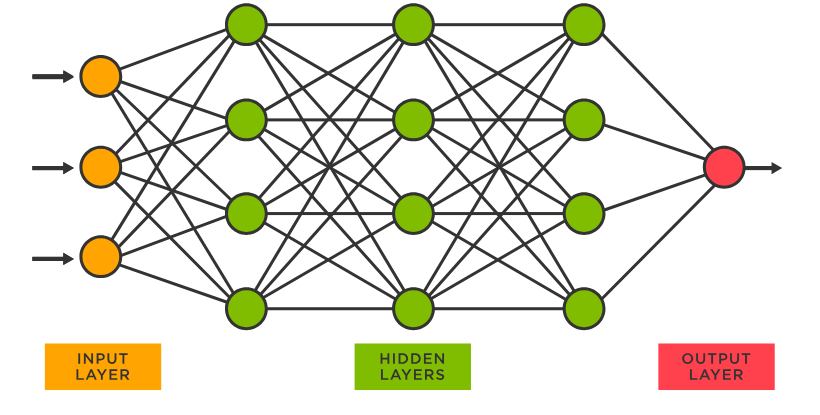

# TP3 SIA - Perceptrón Simple y Multicapa



## Introducción

Trabajo práctico orientativo para la materia Sistemas de Inteligencia Artificial con el
objetivo de implementar un perceptrón simple y multicapa para resolver diversos problemas.

[Enunciado](docs/Enunciado TP3.pdf)

### Requisitos

- Python3
- pip3
- [pipenv](https://pypi.org/project/pipenv/)

### Instalación

Parado en el directorio raiz, ejecutar

```sh
pipenv install
```

para instalar las dependencias necesarias en el ambiente virtual.

# Ejercicio 1
## Ejecución
### `src/ej1/main.py`
El programa `src/ej1/main.py` ejecuta el perceptrón simple para resolver el problema de las compuertas lógicas AND y XOR.
Se ejecuta con el siguiente comando:
````sh
pipenv run python -m src.ej1.main [config_file]
````

#### Resultado
El programa devuelve un archivo CSV con los resultados obtenidos para los individuos de la última generación, con los siguientes datos:
````csv
    Id, w0, w1, ..., wn, Error
````
siendo n la cantidad de entradas del perceptrón.

### `src/ej1/adapter_ej1.py`
Dados los pesos obtenidos en el programa `src/ej1/main.py`, para cada Id (época) se genera puntos (x,y) para graficar la recta que representa el perceptrón.
Se ejecuta con el siguiente comando:
````sh
pipenv run python -m src.ej1.adapter_ej1 [csv_file]
````
siendo csv_file el archivo de salida del programa `src/ej1/main.py`.
"Path del archivo de salida - String"
#### Resultado
El programa devuelve un archivo CSV con los resultados obtenidos para los individuos de la última generación, con los siguientes datos:
````csv
    Id, x, y
````

### `src/ej1/plotter_ej1.py`
Dado el archivo de salida del programa `src/ej1/adapter_ej1.py`, se grafica una animación de la transformación de la recta que representa el perceptrón a través de las épocas.
También, dados los datos de entrada (indicados en el archivo de configuración), se grafican los puntos de entrada.
Se ejecuta con el siguiente comando:
````sh
pipenv run python -m src.ej1.plotter_ej1 [csv_file] [config_file]
````

#### Resultado
El programa devuelve un archivo HTML con la animación de la transformación de la recta, hecho con Plotly.


# Ejercicio 2
## Ejecución
### `src/ej2/main.py`
El programa `src/ej2/main.py` ejecuta el perceptrón simple lineal y no lineal para resolver el problema de los puntos de una función.
Se ejecuta con el siguiente comando:
````sh
pipenv run python -m src.ej2.main [config_file]
````

#### Resultado
El programa devuelve un archivo CSV con los resultados obtenidos para los individuos de la última generación, con los siguientes datos:
````csv
    Id, w0, w1, ..., wn
````
siendo n la cantidad de entradas del perceptrón.

### `src/ej2/x_validation/main.py`
El programa `src/ej2/x_validation/main.py` ejecuta el algortimo de cross-validation.
Se ejecuta con el siguiente comando:
````sh
pipenv run python -m src.ej2.x_validation.main [config_file]
````

#### Resultado
El programa devuelve tres archivos CSV:
1. **Data CSV**: Devuelve el error para los conjuntos de entrenamiento y testeo para cada época (la combinación con menor error de testeo en la última combinación).
````csv
    Epoch, w0, w1, ..., wn, train_error, test_error
````
2. **Train CSV**: Devuelve los datos de entrenamiento para la combinación con menor error de testeo en la última combinación.
````csv
    x1, ..., xn, y
````
3. **Test CSV**: Devuelve los datos de testeo para la combinación con menor error de testeo en la última combinación.
````csv
    x0, x1, ..., xn, y
````
siendo n la cantidad de entradas del perceptrón.

### `src/ej2/x_validation/plotter.py`
Dado el archivo de datos (**Data CSV**) de salida del programa `src/ej2/x_validation/main.py`, se grafica el error de entrenamiento y testeo a través de las épocas.
Se ejecuta con el siguiente comando:
````sh
pipenv run python -m src.ej2.x_validation.plotter [config_file]
````

#### Resultado
El programa grafica el error de entrenamiento y testeo a través de las épocas, hecho con Plotly.

# Ejercicio 3
## Ejecución
#### Desde src, correr
```shell
 python -m ej3.cruncher ej3/configs/config_cruncher.json
```
#### A continuación, se detallan los valores posibles para especificar en el archivo __config_cruncher.json__
## Configuración
### En general, la configuración sigue el siguiente formato
```json
{
  "input": "Path del archivo de entrada - String",
  "input_length": largo de la entrada,
  "perceptrons_for_layers": [35, 10, 10, 10, 10"Estructura de la red neuronal en formato vector",
  "activation": ["LOGISTIC"],
  "expected": [
                [1, 0, 0, 0, 0, 0, 0, 0, 0, 0],
                [0, 1, 0, 0, 0, 0, 0, 0, 0, 0],
                [0, 0, 1, 0, 0, 0, 0, 0, 0, 0],
                [0, 0, 0, 1, 0, 0, 0, 0, 0, 0],
                [0, 0, 0, 0, 1, 0, 0, 0, 0, 0],
                [0, 0, 0, 0, 0, 1, 0, 0, 0, 0],
                [0, 0, 0, 0, 0, 0, 1, 0, 0, 0],
                [0, 0, 0, 0, 0, 0, 0, 1, 0, 0],
                [0, 0, 0, 0, 0, 0, 0, 0, 1, 0],
                [0, 0, 0, 0, 0, 0, 0, 0, 0, 1]
  ],
  "beta": "Valor beta a utilizar - Double",
  "n": "Valor eta a utilizar - Double",
  "error": "Tipo de error a utilizar - String",
  "epsilon": "Mínimo error necesario para cortar - Double",
  "limit":"Límite de iteraciones - Integer",
  "batch": "Cantidad de datos a utilizar para entrenar por época - Integer",
  "test_pct": 1,
  "noise_stddev": "",
  "repetition":"",
  "adaptive_eta": "true or false dependiendo de si se desea usar eta adaptativo - Boolean",
  "adaptive_eta_iterations_increment": "Iteraciones requeridas para decrementar el n - Integer",
  "adaptive_eta_iterations_decrement": "Iteraciones requeridas para decrementar el n - Integer negativo",
  "adaptive_eta_increment": "Factor de crecimiento del n - Double",
  "adaptive_eta_decrement_constant": "Factor de decrecimiento del n - Double",
  "output": "Path del archivo de salida - String"
}
```
### Para par-impar (ejercicio 3.B)
```json
{
  "input": "ej3/data/TP3-ej3-digitos.csv",
  "input_length": 35,
  "perceptrons_for_layers": [35, 10, 10, 10, 10],
  "activation": ["LOGISTIC"],
  "expected": [
                [1,0],
                [0,1],
                [1,0],
                [0,1],
                [1,0],
                [0,1],
                [1,0],
                [0,1],
                [1,0],
                [0,1]
  ],
  "beta": [1],
  "n": [0.1],
  "error": "QUADRATIC_MULTILAYER",
  "epsilon": 0,
  "limit":1000,
  "batch": [5],
  "test_pct": 1,
  "noise_stddev": 0.0001,
  "repetitions": 3,
  "adaptive_eta": [false],
  "adaptive_eta_iterations_increment": 15,
  "adaptive_eta_iterations_decrement": -8,
  "adaptive_eta_increment": 0.1,
  "adaptive_eta_decrement_constant": 0.5,
  "output": "adaptive_eta_variation_ejA"
}
```
### Para XOR (ejercicio 3.A)
```json
{
  "input": "ej3/data/TP3_ej1_XOR.csv",
  "input_length": 2,
  "perceptrons_for_layers": [2, 10, 10, 10, 2],
  "activation": ["LOGISTIC"],
  "expected": [
                [1,0],
                [1,0],
                [0,1],
                [0,1]
  ],
  "beta": [1],
  "n": [0.1],
  "error": "QUADRATIC_MULTILAYER",
  "epsilon": 0,
  "limit":1000,
  "batch": [4],
  "test_pct": 1,
  "noise_stddev": 0.0001,
  "repetitions": 3,
  "adaptive_eta": [false],
  "adaptive_eta_iterations_increment": 15,
  "adaptive_eta_iterations_decrement": -8,
  "adaptive_eta_increment": 0.1,
  "adaptive_eta_decrement_constant": 0.5,
  "output": "adaptive_eta_variation_ejA"
}
```