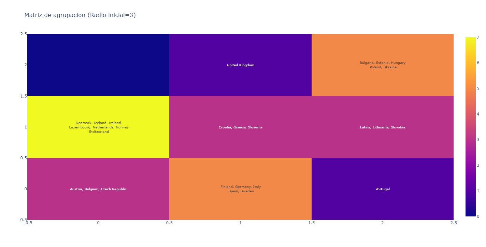
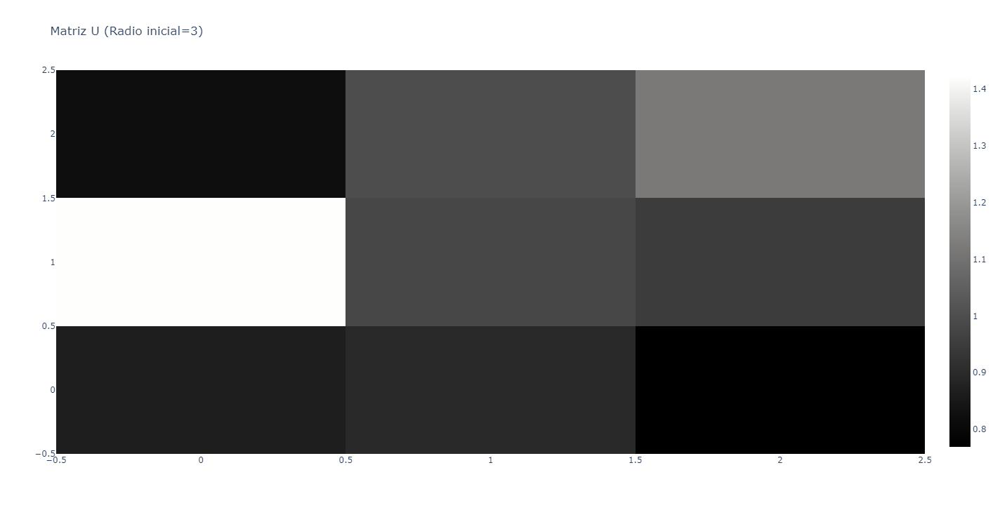
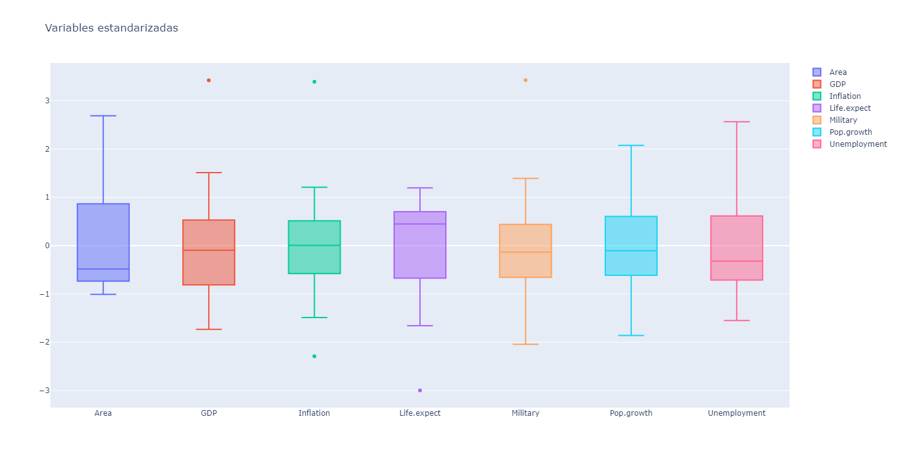
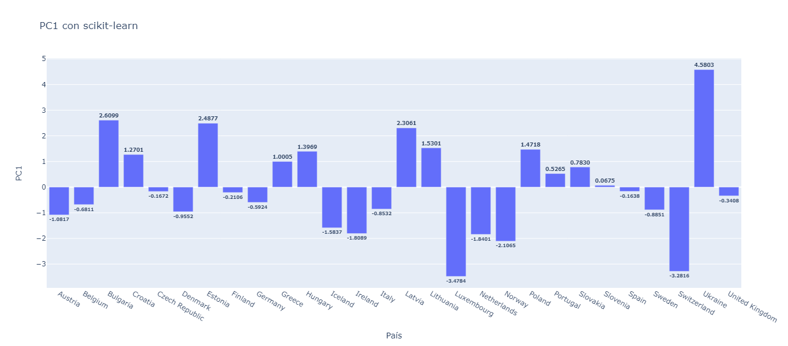
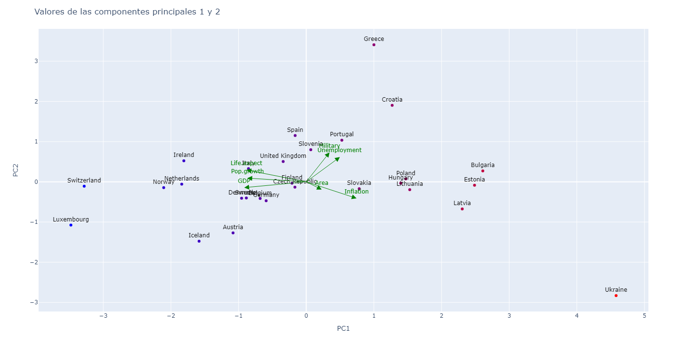
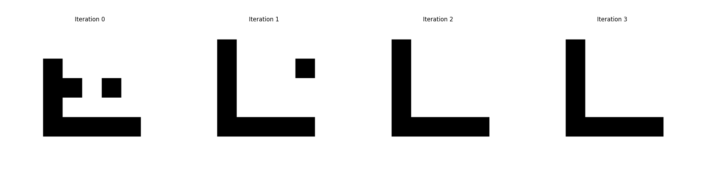

# TP4 SIA - Aprendizaje No Supervisado

## Introducción

Trabajo práctico orientativo para la materia Sistemas de Inteligencia Artificial con el
objetivo de implementar diversos algoritmos de aprendizaje no supervisado.

[Enunciado](docs/Enunciado.pdf)

### Requisitos

- Python3
- pip3
- [pipenv](https://pypi.org/project/pipenv/)

### Instalación

Parado en el directorio raiz, ejecutar

```sh
pipenv installdd
```

para instalar las dependencias necesarias en el ambiente virtual.


# Ejercicio 1 - Kohonen
## Ejecución
### `src/kohonen/main.py`
El programa `src/kohonen/main.py` ejecuta el algoritmo de Kohonen para resolver el problema de clustering de países.
Se ejecuta con el siguiente comando:
```sh
pipenv run python src/kohonen/main.py [config_file]
```

```json
{
  "input": "Archivo CSV de entrada - String",
  "initial_radius": "Radio inicial - Float",
  "initial_eta": "Eta inicial - Float",
  "size": "Tamaño de la red (k) - Int",
  "variable_radius": "Indica si el radio es variable - Boolean",
  "variable_eta": "Indica si el eta es variable - Boolean",
  "mult_iterations": "Cantidad de epocas - Int",
  "similarity": "Función de similitud - [EUCLIDES, EXP]",
  "data_initialization": "Indica si los datos se inicializan con los datos - Boolean",
  "heatmap_title": "Título del gráfico de Heatmap - String",
  "u_matrix_title": "Título del gráfico de la Matriz U - String"
}
```

#### Resultado
El programa muestra en pantalla los gráficos Heatmap y Matriz U luego de entrenar el modelo con los datos de entrada.





# Ejercicio 2 - Componentes Principales
## Ejecución
### PCA - `src/PCA/main.py`
El programa `src/PCA/main.py` ejecuta el algoritmo de PCA, utilizando la libreria [scikit-learn](https://scikit-learn.org/stable/)
Se ejecuta con el siguiente comando:
````sh
pipenv run python src/PCA/main.py [config_file]
````

```json
{
  "input": "Archivo CSV de entrada - String",
  "n_components": "Cantidad de componentes principales - Int"
}
```

#### Resultado
El programa muestra en pantalla los gráficos de:
- Boxplot de las variables estandarizadas
   <br> 
- Gráfico de barras de PC1 por país
   <br>
- Biplot de PC1 y PC2
   <br>

También imprime por STDOUT un listado de los países ordenados (ascendentemente) por su valor de PC1.


### Oja - `src/oja/main.py`
El programa `src/oja/main.py` ejecuta el algoritmo de la regla de Oja, obteniendo el autovector asociado a PC1.
Se ejecuta con el siguiente comando:
````sh
pipenv run python -m src.oja.main [config_file]
````

````json
{
  "input": "Archivo CSV de entrada - String",
  "eta": "Eta inicial - Float",
  "limit": "Cantidad de epocas - Int"
}
````


#### Resultado
El programa imprime por STDOUT el autovector asociado a PC1.


### Sanger - `src/sanger/main.py`
El programa `src/sanger/main.py` ejecuta el algoritmo de la regla de Sanger, obteniendo los autovectores asociados a las componentes principales.
Se ejecuta con el siguiente comando:
````sh
pipenv run python -m src.sanger.main [config_file]
````

````json
{
  "input": "Archivo CSV de entrada - String",
  "eta": "Eta inicial - Float",
  "limit": "Cantidad de epocas - Int",
  "n_components": "Cantidad de componentes principales - Int"
}
````

#### Resultado
El programa imprime por STDOUT los autovectores asociados a las componentes principales.


# Ejercicio 3 - Patrones - Modelo de Hopfield


## Ejecucion
### `src/hopfield/main.py`
Este programa toma un conjunto de patrones a almacenar y un patron que intentara reconocer utilizando el modelo de Hopfield.
Se ejecuta con el siguiente comando:
```sh
pipenv run python src/hopfield/main.py [config_file]
```

Donde un ejemplo de config_file es el siguiente:
```json
{
  "input": "storedPatterns.txt",
  "try": "try.txt",
  "size": 25,
  "max_iterations": 100,
  "noise": false,
  "probability_of_noise": 0.9,
  "plot_states": true,
  "plot_energy": true,
  "plot_stored_patterns": true
}
```

- "input" -> Archivo con los patrones a almacenar
- "try" -> Archivo con el patron a reconocer
- "size" -> Dimension de la entrada. Debe ser la multiplicacion de ancho y alto.
- "max_iterations" -> Cantidad de iteraciones maxima en caso de no encontrar un estado repetido previamente
- "noise" -> Booleano, que determina si se aplicara ruido o no a la entrad
- "probability_of_noise" -> En caso de que "noise": true, es la probabilidad con la que se alterara una posicion del patron
- "plot_states" -> Booleano, indica si se quiere hacer un grafico de la evolucion de los estados
- "plot_energy" -> Booleano, indica si se quiere hacer un grafico de la evolucion de la energia de Hopfield
- "plot_stored_patterns" -> Booleano, indica si se quiere hacer un grafico de los patrones almacenados

### `src/hopfield/analysis.py`
Este programa toma todos los patrones disponibles, y busca combinaciones de tamaño parametrizable analizando la ortogonalidad entre si.
Al final, muestra dos graficos, los primeros 25 con menor ortogonalidad promedio y los ultimos 5.
```sh
pipenv run python src/hopfield/analysis.py [config_file]
```


```json
{
  "input": "letters.txt",
  "combination_size": 7,
  "try": "try.txt",
  "size": 25,
  "max_iterations": 100
}
```
- "input" -> Archivo donde se almacenen todos los patrones
- "combination_size" -> Tamaño de las combinaciones
- "size" -> Dimension de la entrada. Debe ser la multiplicacion de ancho y alto.
- "max_iterations" -> Cantidad de iteraciones maxima en caso de no encontrar un estado repetido previamente

### `src/hopfield/analysis_multiple_combinations.py`
Este programa repite el análisis anterior, pero para un rango de tamaño de combinaciones. 
```sh
pipenv run python src/hopfield/analysis_multiple_combinations.py [config_file]
```
Toma el mismo config que el anterior, pero se mostrará un grafico de barras, con la ortogonalidad promedio minima para cada tamaño de combinaciones.
