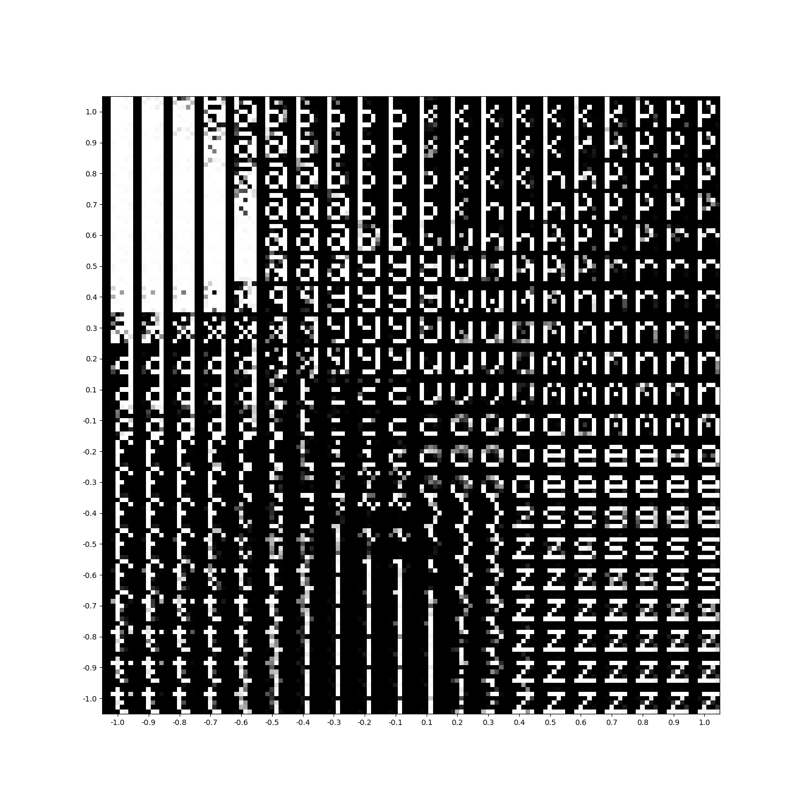

# TP5 SIA - Deep learning



## Introducción

Trabajo práctico orientativo para la materia Sistemas de Inteligencia Artificial con el
objetivo de implementar algoritmos de deep learning. 

[Enunciado](docs/SIATP5.pdf)

### Requisitos

- Python3
- pip3
- [pipenv](https://pypi.org/project/pipenv/)

### Instalación

Parado en el directorio raiz, ejecutar

```sh
pipenv install
```

para instalar las dependencias necesarias en el ambiente virtual.


# Ejercicio 1.a - Autoencoder
## Ejecución
### `src/autoencoder.py`
El programa `autoencoder.py` ejecuta el entrenamiento de un autoencoder para el dataset de letras provisto por la cátedra.
Se ejecuta con el siguiente comando:
```sh
cd src
pipenv run python autoencoder.py [config_file]
```

```json
{
  "input": "Archivo de donde obtener los datos - String",
  "pickle_output": "archivo donde se guarda el autoencoder entrenado - String",
  "input_length": "Longitud del input - Integer",
  "perceptrons_for_layers": "Arquitectura del encoder (que se hace espejada para el decoder) - List[Integer]",
  "activation": "Función de activación - String",
  "beta": "Valor de beta para la función de activación - Double",
  "n": "Learning rate - Double (no se usa con optimizadores como ADAM)",
  "optimizer": "Optimizador - String",
  "optimizer_config": {
    "adaptive_eta_iterations_increment": "Iteraciones requeridas para decrementar el n - Integer",
    "adaptive_eta_iterations_decrement": "Iteraciones requeridas para decrementar el n - Integer negativo",
    "adaptive_eta_increment": "Factor de crecimiento del n - Double",
    "adaptive_eta_decrement": "Factor de decrecimiento del n - Double",
    "adam_alpha": "Double",
    "adam_beta1": "Double",
    "adam_beta2": "Double",
    "adam_epsilon": "Double",
    "momentum_beta": "Double",
    "momentum_alpha": "Double"
  },
  "error": "Medida de error para el usuario - String",
  "condition": "Condición de corte - String",
  "condition_config": {
    "epsilon": "Mínimo error necesario para cortar - Double",
    "min_pixel_error": "Mínimo error en pixels necesario para cortar - Double"
  },
  "limit": "Límite de iteraciones - Integer",
  "batch": "Cantidades de datos a utilizar para entrenar por época - Integer"
}
```


# Ejercicio 1.b - Denoising Autoencoder
## Ejecución
### `src/denoisingAutoencoder.py`
El programa `src/denoisingAutoencoder.py` ejecuta el entrenamiento de un denoising autoencoder para el dataset provisto por la catedra con distintos tipos de ruido
Se ejecuta con el siguiente comando:
````sh
cd src
pipenv run python denoisingAutoencoder.py [config_file]
````

```json
{
  "input": "Archivo de donde obtener los datos - String",
  "pickle_output": "archivo donde se guarda el autoencoder entrenado - String",
  "input_length": "Longitud del input - Integer",
  "perceptrons_for_layers": "Arquitectura del encoder (que se hace espejada para el decoder) - List[Integer]",
  "activation": "Función de activación - String",
  "beta": "Valor de beta para la función de activación - Double",
  "n": "Learning rate - Double (no se usa con optimizadores como ADAM)",
  "optimizer": "Optimizador - String",
  "optimizer_config": {
    "adaptive_eta_iterations_increment": "Iteraciones requeridas para decrementar el n - Integer",
    "adaptive_eta_iterations_decrement": "Iteraciones requeridas para decrementar el n - Integer negativo",
    "adaptive_eta_increment": "Factor de crecimiento del n - Double",
    "adaptive_eta_decrement": "Factor de decrecimiento del n - Double",
    "adam_alpha": "Double",
    "adam_beta1": "Double",
    "adam_beta2": "Double",
    "adam_epsilon": "Double",
    "momentum_beta": "Double",
    "momentum_alpha": "Double"
  },
  "error": "Medida de error para el usuario - String",
  "condition": "Condición de corte - String",
  "condition_config": {
    "epsilon": "Mínimo error necesario para cortar - Double",
    "min_pixel_error": "Mínimo error en pixels necesario para cortar - Double"
  },
  "limit": "Límite de iteraciones - Integer",
  "batch": "Cantidades de datos a utilizar para entrenar por época - Integer", 
  "noise": "Tipo de ruido a aplicar - String",
  "noise_config": {
    "noise_stddev": "Desvio estandar del ruido gaussiano a aplicar - Double",
    "noise_median": "Media del ruido gaussiano a aplicar - Double",
    "noise_prob": "Probabilidad de que ocurra un switch en el pixel en random switch - Double (0-1)",
    "salt_prob": "Probabilidad de que se cambie un pixel 0 por un 1 - Double (0-1) ",
    "pepper_prob": "Probabilidad de que se cambie un pixel 1 por un 0 - Double (0-1)"
  }
}
```


# Ejercicio 2 - VAE

## Ejecucion
### `VAE.py`
El programa `src/VAE.py` ejecuta el entrenamiento de un variational autoencoder.
Se ejecuta con el siguiente comando:
```sh
cd src
pipenv run python VAE.py [config_file]
```

Donde un ejemplo de config_file es el siguiente:
```json
{
  "input": "Archivo de donde obtener los datos - String",
  "encoder_pickle_input": "Archivo del encoder si se quiere usar uno entrenado - String/false",
  "decoder_pickle_input": "Archivo del encoder si se quiere usar uno entrenado - String/true",
  "encoder_pickle_output": "Nombre del archivo para guardar en encoder - String",
  "decoder_pickle_output": "Nombre del archivo para guardar en decoder - String",
  "names_description": "Nombres para agregarle a los archivos de salida - String",
  "train": "Si se desea entrenar a los mlp - Boolean",
  "input_length": "Longitud del input - Integer", 
  "encoder_hidden": "Lista de capas ocultas para el encoder - List[Integer]",
  "decoder_hidden": "Lista de capas ocultas para el decoder - List[Integer]",
  "activation": "Función de activación - String",
  "beta": "Valor de beta para la función de activación - Double",
  "n": "Learning rate - Double (no se usa con optimizadores como ADAM)",
  "optimizer": "Optimizador - String",
  "optimizer_config": {
    "adaptive_eta_iterations_increment": "Iteraciones requeridas para decrementar el n - Integer",
    "adaptive_eta_iterations_decrement": "Iteraciones requeridas para decrementar el n - Integer negativo",
    "adaptive_eta_increment": "Factor de crecimiento del n - Double",
    "adaptive_eta_decrement": "Factor de decrecimiento del n - Double",
    "adam_alpha": "Double",
    "adam_beta1": "Double",
    "adam_beta2": "Double",
    "adam_epsilon": "Double",
    "momentum_beta": "Double",
    "momentum_alpha": "Double"
  },
  "error": "Medida de error para el usuario - String",
  "condition": "Condición de corte - String",
  "condition_config": {
    "epsilon": "Mínimo error necesario para cortar - Double",
    "min_pixel_error": "Mínimo error en pixels necesario para cortar - Double"
  },
  "limit": "Límite de iteraciones - Integer",
  "batch": "Cantidades de datos a utilizar para entrenar por época - Integer"
}
```

